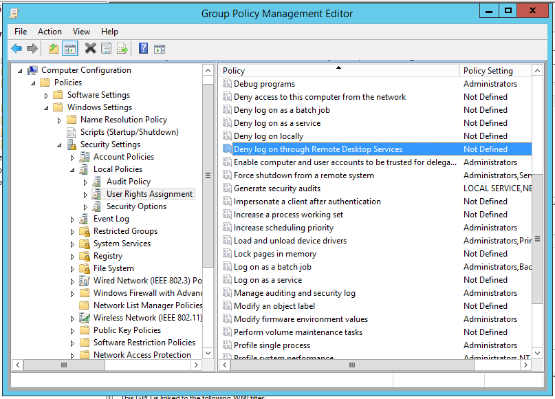
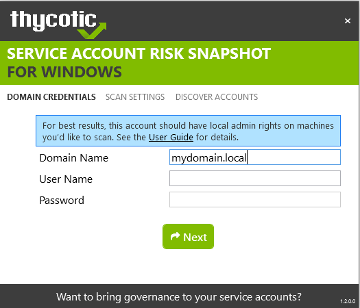
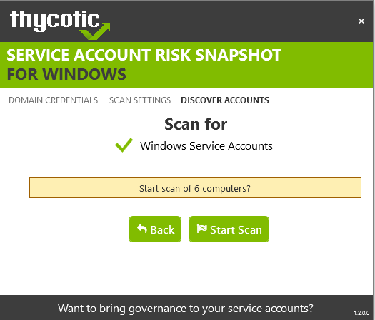

[title]: # (Service Account Risk Snapshot Tool)
[tags]: # (Account Lifecycle Manager,ALM,)
[priority]: # (8400)

# Service Account Risk Snapshot Tool

This free tool helps assess the level of risk associated with your inventory of service accounts in AD by connecting to Windows machines across your network and scanning for local and service account usage.
 
## Prerequisites

The Service Account Risk Snapshot Tool supports Windows 7, 8, 8.1, and 10.

The machine on which it executes must have Microsoft’s .NET Framework 4.5.1 or higher.

In order to scan for service accounts, the account entered must be a domain account that is in the Administrators group on the target machines. Using a domain admin account to run the tool will often be sufficient for scanning your network.

These steps will ensure the account has the appropriate privileges to run a successful scan.

* Open the Group Policy editor for your domain policy.

* Go to **Computer Configuration** \> **Preferences** \> **Control Panel Settings**.

* Right-click **Local Users and groups** and select **New** \> **Local Group**.

* Leave the **Action** value set as **Update**.

* For **Group name:**, use the drop-down menu to select **Administrators (Built-in)**.

* Click **Add…** and search for the account you will use for Discovery scanning.

* Click **OK** to save your changes. The next time the group policy updates across your environment, the Discovery Account will be part of the Local Administrators group.

For the best security, configure Group Policy to limit the logon privileges of that account:

* In the Group Policy editor for your domain policy, go to **Computer Configuration** \> **Policies** \> **Windows Settings** \> **Security Settings** \> **Local Policies** \> **User Rights Assignment**.

* Add your Discovery account to the **Deny log on locally** and **Deny log on through Remote Desktop Services** policies at right.

* Optional: make sure that the account is not part of the Remote Desktop Users group.

## Ports

The Discovery scan makes use of several ports to connect to the target Windows
machines to scan them for local and service account usage.

| **Traffic Type**         | **Ports Used**         |
|--------------------------|------------------------|
| RPC Dynamic Port Range   | 1025-5000, 49152-65535 |
| Microsoft DS             | 445                    |
| epmap                    | 135                    |

The RPC Dynamic Port ranges are a range of ports utilized by Microsoft’s Remote Procedure Callback (RPC) functionality. This port range varies by operating system. For Windows Server 2008 or greater, this port range is 49,152 to 65,535. This entire port range must be open for RPC technology to work.

## Walkthrough

After downloading the Discovery Tool, unzip it and run **ThycoticServiceAccountRiskSnapshotAnalyzer.exe** or, if you prefer, rename the executable file to something easier to type, and then run it.

### Domain Credentials

The scanner will first prompt for credentials and the fully-qualified domain name (FQDN) of the domain you would like to scan. Use the credentials you configured earlier.

* These will be used for scanning, but the scanner tool does not save them for subsequent use.

* When you have provided the credentials, use the **Next** control to proceed.

If the scanner cannot reach the domain or the credentials are not valid, it will state that it cannot connect to the domain with supplied credentials.

In that case, check your credentials or use different credentials. 

### Scan Settings

The scanner allows you to choose whether to discover accounts across the entire domain or only accounts in a specific OU. Scanning a specific OU will limit the number of computers the tool investigates.

### Discovering Accounts

Before you start the scan, review the number of computers the discovery tool retrieved from Active Directory based on what OU or domain you chose to scan. If the numbers seem ballpark, click **Start Scan**. If you think the number of computers to be scanned seems improbably high, consult your IT support staff for guidance.

While the scan runs, you will see the number of computers scanned progress. You can stop the scan at any point and generate the reports based off of the accounts discovered so far.

The time to complete the scan will vary based on network latency, the number of machines, and how many machines actually exist. Testing in a large environment resulted in a scan of approximately 1,000 Windows machines in slightly under an hour.

### Results

Once the scan completes, you can generate the Executive Summary report and the detailed CSV reports. Just enter a company name and click **Generate Reports**.

The reports will be created in the folder you select. They consist of two files.

| **File**                                | **Description**            |
|-----------------------------------------|----------------------------|
| ThycoticServiceAccountRiskSnapshot.html | Summary report of findings |
| ThycoticServiceAccountRiskSnapshot.pdf  | Summary report of findings |

### FAQ

**Q:** Why doesn’t the inventory report show results for all machines in my domain?

**A:** If there were any issues connecting to a machine, such as network connectivity, insufficient permissions, or closed ports, the machine will not show up in the results. You can investigate the scan log located in the tool folder’s **log** subfolder, which will contain errors for machines that couldn’t be scanned.

**Q:** How long will it take to scan my domain?

**A:** The time to discover accounts will vary depending on network latency and number of machines that respond. A test environment of approximately 1,000 Windows machines took 50 minutes. We recommend testing out your scan first on a smaller OU to get a sense of time and results before scanning a larger OU or your full domain.

**Q:** The PDF report has inconsistent margins or page breaks.

**A:** Some display drivers or screen resolutions can cause these PDF defects. Run the scan from a different machine, or use the HTML version. The HTML file contains the same information as the PDF.

  

  
