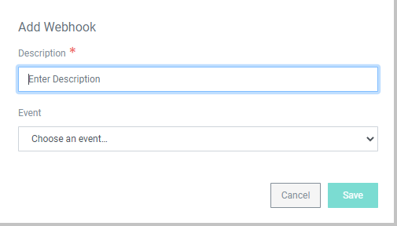

[title]: # (Alert Settings)
[tags]: # (Account Lifecycle Manager,ALM,Active Directory,)
[priority]: # (5180)

# Alert Settings

## Email Templates

Administrators can modify and enable/disable emails that are generated and sent automatically by ALM. To modify an **Email Template**:
<table>
<tr valign="top">
<td>

1. Navigate to **Alert Settings** and click **Email Templates**. The Templates are named after the event in ALM that will trigger the Email.
1. Click the name of the Template to bring up the **Manage Email Template** page. From here you can:
    * Change the **Subject** line of the Email.
    * Change the **Body** of the Email. Use the **Parameters** variables to customize the message. You can add the Parameters by retyping them or clicking **insert**.
1. **Enable** or **Disable** the Email using the toggle. 
1. Click **Save** when you are finished. 

</td>
<td valign="top" width="33%">

</td>
</table>

## Webhooks

ALM allows Users with **Webhook Permissions** to set up custom integrations using webhooks. 

### Creating a Webhook

To create a webhook:

<table>
<tr valign="top">
<td>

1. Navigate to **Alert Settings** and click **Webhooks**.
1. In the upper right-hand corner, click **Create Webhook** to bring up the **Add Webhook** window.
1. Enter a description of the webhook.
1. Choose the **Event** within ALM that will trigger the webhook.
1. Click **Save** to bring up the **Manage Webhook** page. 
    > **Note**: The webhook will not be created until after setup is completed.

</td>

<td halign="right">

</td>
</tr>

<tr valign="top">

<td>

6. On the **Manage Webhook** page, enter the complete **Callback** URL. The **Message Body** shows the data that will be sent to the URL.
1. Check the box next to **Enabled** to activate the webhook. Leave the box unchecked to keep the webhook inactive. It can be enabled later from this page.
1. (Optional) Add **Authorization** to the webhook by clicking the green toggle and selecting the corresponding authorization from the drop-down. You can also adjust the authorization header for the callback url of the webhook. *If you have not previously configured Webhook Authorization, see the section below. If needed, you can save the webhook and return later to add authorization.*
1. Click **Save** to create the webhook.
1. Once the webhook is created and enabled, you can view its usage details from the **Webhook History** tab at the top of the page. 

</td>

<td style="width:33%">

</td>
</table>

###  Webhook Authorization

You can enable Webhook authentication using **Webhook Authorization**. To create a new Webhook Authorzation:

<table>
<tr valign=top>
<td>

1. From the left-hand navigation menu, click **Webhook Authorizations**.
1. In the top-right corner, click **Create Webhook Authorization**.
1. Enter a **Name** and select an **Authentication Type**. ALM currently supports **Basic** and **OAuth** authentication. Click **Save** to bring up the **Manage Webhook Authorization** page. 
1. On the **Manage Webhook Authorization** page, enter:
    * The **URL** of the authentication server.
    * The **Content Type** of the webhook.
    * The **Token Map** that points to the location of the authorization response.
    * The **Authentication ID** and **Authentication Secret** that will log in to the end point.
1. **Message Body** displays the contents of the authorization message. Use **insert** to add variables from Authentication ID and Authentication Secret to the body. You can create lines in the message by clicking **Add Value**. Remove a value by clicking the minus (-) to the right of the value field. 
1. When you are finished, click **Save**. The new Webhook Authorization will now appear as an option when managing webhooks.

</td>

<td halign=right style="width:120px">

</td>
</table>