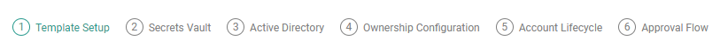
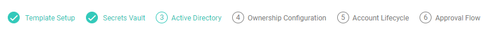

[title]: # (Workflow Templates)
[tags]: # (Account Lifecycle Manager,ALM,Active Directory,)
[priority]: # (5170)

# Build Workflow Templates

Workflows in ALM define the approval processes for Service Accounts. Once a Template is completed and published, Requestors can use ALM to request that a Service Account be created.

## Overview

ALM supplies a straightforward, Roles-driven workflow system to support your oversight of new AD account creation, review, and eventual renewal or retirement.

ALM represents your approval processes as Workflow Templates. Each template defines the approval process for a particular service account kind or category as defined by your organization.

ALM’s workflow system follows a simple, linear process from template definition through account Requests and Approvals.

## Creating and Managing Workflows

Create and manage Workflows from the **Workflow Templates** page. Click **Administration** in the left-hand menu and click **Workflow Templates**.

### Create a Workflow

Use this procedure to create the Workflow Templates necessary to support your organization’s use cases. You must have the System Administrator Role to perform this procedure, and you must have already connected ALM to your Secrets Vault.

* Click **Create Template** in the upper right hand corner to bring up the **Workflow Template Wizard**

1. **Template Setup**
    1. Give the Template a name and select the **Account Type** from the drop-down menu. The Account Type should correspond to the directory service that will be used for this Template.
    2. Select an **End of Lifecycle Action**. Later in the wizard, you will choose the time interval for these actions to take effect.
        1. **Review**- a notification will be sent to the User reminding them that the Service Account is active. ALM will not change the Service Account at this point. Users are given the following options
            * **Renew**- extends the account's lifecycle until the next Review date. The renewal period starts at UTC 00:00.
            * **Disable**- deactivates the account in ALM and AD. The User **can** re-enable the account.
            * **Delete Account and Secret**- removes the Service Account.

        1. **Disable**- the Service Account will be automatically disabled unless it is **Renewed** by the Account Owner. Users are given the following options
            * **Renew**- extends the account's lifecycle until the next Review date. The renewal period starts at UTC 00:00.
            * **Disable**- deactivates the account in ALM and AD. The User **can** re-enable the account.
            * **Delete Account and Secret**- removes the Service Account.

        1. **Expire**- the Service Account will be automatically deactivated, but it can still be reactivated be repeating the Approval process. Users are given the following options
            * **Submit for Approval to Renew**- the Account is submitted again to the Approvers. If approved, the account is renewed. If denied, the account will expire.
            * **Disable**- deactivates the account in ALM and AD. The User **can** re-enable the account.
            * **Delete Account and Secret**- removes the Service Account.

        1. **Delete**- the Service Account is disabled, and **cannot be renewed**. Users are given the following options
            * **Disable**- deactivates the account in ALM and AD.
            * **Delete Account and Secret**- removes the Service Account.
            * **Clone as New Request**- generates a new request identical to the provisioned account. The User then completes the new request and submits for approval.

    1. The **Terms of Service** should reflect your organization's guidelines for the use of new Service Accounts. The Requestor of the new account must agree to the terms you set before the account is provisioned.
    1. Enter the **Purpose** for the Workflow. The purpose will be provided to Users when they request a new account, so they know which template to choose for their request.
    1. Click **Save + Next**.
  

2. **Secrets Vault** 
    1. For **System**, choose the Secrets Vault to use for Accounts on this Template. The **Type** of Vault should populate automatically based on your selection.
    2. For **Template**, choose the directory type associated with the workflow.
    3. Click **Select Folders** and choose where the secrets for this workflow will be stored. Checking **Allow Folder Override** will let the Requestor choose folders within the selected index to store the account's secrets.
    4. Click **Save + Next**.

3. **Active Directory**
    1. Choosing a **Name Prefix** is optional, but it is *highly recommended* that you use a prefix if your organization has a large number of Service Accounts. Using prefixes will make organizing large numbers of accounts easier.
    1. Defining **Name Regex** is also optional. Setting regex will force Requestors to follow specific naming conventions when using this Template. You can input any limiting pattern using *.NET native* regex. 
    1. Select the **Active Directory Server** that Service Accounts on the template will use.
    1. For **OU Distinguished Name**, click **select** and choose the Organization Unit(s) that Service Accounts will belong to. Click **add**.
    1. Toggling **Allow Choosing Sub-OUs** to **Yes** will allow the Requester to choose a sub-ou within the folder you have designated. Toggling to **No** will restrict the Requester to only the OU you have designated.
    1. Use the drop-down menu to select the **Attributes** for the Service Accounts. You have the option to **Require** each attribute or mark it as **Read-only**. Click the **plus** to add the attribute. Edit the attribute using the **pencil** icon, or remove it by clicking the red **X**.
    1. Selecting **Groups** will limit access to this template to Users in the selected Group. Use the drop-down menu to find the Group and click the **plus**. You may add multiple Groups.

4. **Ownership Configuration**
    1. Set the **Allow Group Ownership** toggle to **Yes** to allow the newly created account to be shared among multiple owners without restrictions.
    1. Setting the toggle to **No** will bring up additional ownership options.
        * Toggling **Requester Only Owner** to **Yes** will restrict ownership of new accounts to only the Requester. Toggling to **No** will allow other users to have ownership of the account.
        * Set the number of **Minimum Owners** and **Maximum Owners** for new accounts using this template. 
    

5. **Account Lifecycle**
    1. The **Review/Expire Period Options** section shows the lifecycle length options that will be available to the Requestor when they request a new account. You can customize the options by editing the **number field** and selecting **Day(s)** or **Year(s)**. Click the **plus** to add the option.
    1. **Enable re-approval before end of lifecycle** will allow the Account Owner to request a renewal of the account before the chosen date of Review/Expiration. Use the arrows to set the re-approval time period.
    1. Check **Send notification when renewal is available** to automatically notify the Account Owner when re-approval is available.
    1. You can have the renewal notification resent at intervals. Check **send reminder to owner** and use the arrows to set the interval that ALM will send notifications.
    1. You can also have more frequent reminders sent. Check **Send urgent notifications** and use the arrows to set an hourly interval to send reminders and the number of days before the end-of-lifecycle to begin sending the hourly reminders.
    1. Check **Include system administrators** to have ALM send the reminder to the Account Owner and the System Admin.
    1. To stop reminders automatically, check **Stop sending notifications** and use the arrows to select the number of days after the start of notifications to stop sending.
    

6. **Approval Flow**
    1. Toggling **Hide Approver Names From Requesters** to **Yes** will restrict users requesting a new account from seeing who in the organization can approve their request.
    1. The Approval Flow will dictate which approvals are required before the account is provisioned. 
    1. Click **Add** to add a step to the Approval Flow.
    1. From the **Actions** drop-down list, select a User or Group of Users that can Approve new Accounts using this template.
    1. In the **Require at least** box, use the arrows to change the number of approvers needed from the list of Users/Groups. 
    1. You can add another step to change the number of approvals needed from separate Groups or Users by clicking **Add Step** from the Actions drop-down.
    1. Click **Publish** to finish creating the template. **Once a Template is Published, it cannot be edited further without first being unpublished.**

> **Note**: Requiring approval from one, specific individual can create a bottleneck. To avoid creating a bottleneck, Thycotic recommends choosing a Group of managers and requiring two approvers.

### Managing Workflow Templates

Review and make changes to a Workflow Template by clicking on the Template Name to bring up the Template page. 

From this page you can

* **Edit Draft Workflow Templates**- Before a Template is published, you can edit the Template Setup, Secrets Vault, Active Directory, Account Lifecycle, and Approval Flow. Published Templates must be unpublished before they are edited.

* **Unpublish Workflow Template**- Open the Template and click **Unpublish** in the upper right-hand corner. You can now edit the Template and republish it when you are finished.

* **Disable Workflow Template**- Click **Disable** in the upper right-hand corner. Requestors will no longer be able to select this Template when requesting a new Service Account.

### Workflow Template Versioning

**Workflow Template Versioning** allows System Administrators to update a published Workflow without needing to disable or unpublish the Template.

To create a new version of an existing Workflow Template

1. Open the Template and select **Create New Version**.
1. ALM will prompt for confirmation that the System Administrator wants to create a new version of the Workflow Template.
1. When a new version of a Workflow Template is published, all new Account Requests will use the newest Template version.
1. All accounts previously provisioned to prior versions will remain associated to the version they were provisioned against.

Users with permissions to access Workflow Templates will be able to view the specification of previous versions for change tracking. The Managed Accounts view will display which version of a Workflow Template the account is provisioned against.