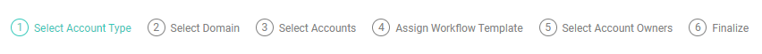
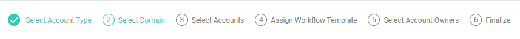
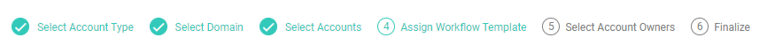

[title]: # (Account Migration)
[tags]: # (Account Lifecycle Manager,ALM,Active Directory,)
[priority]: # (5190)

# Account Migration

Using the **Account Migration Wizard**, administrators can move existing accounts to different workflow templates. 

>**NOTE**: Only accounts that are *active* and *before* their end-of-lifecycle can be migrated. 

1. **Select Account Type**
    1. From the **Account Type** drop-down menu, choose from Active Directory, Azure Active Directory, or Group Managed Service Account.
    1. Click **Save + Next** in the upper right-hand corner.

2. **Select Domain**
    1. Choose the domain of the account(s) to be migrated by clicking in the circle to the right of the domain name.
    1. Click **Save + Next** in the upper right-hand corner.

3. **Select Accounts**
    1. Choose the accounts to be migrated by clicking the check box to the right of the account name.
    1. Click **Save + Next** in the upper right-hand corner.

4. **Assign Workflow Template**
    1. Select the new **Workflow Template** from the dropdown menu.
    1. Select the new **Review Interval** from the dropdown menu.
    1. Choose a new **Lifecycle End Date**.
    1. Click **Save + Next** in the upper right-hand corner.

5. **Select Account Owners**
    1. The list of **Account Owners** will populate with the names of the current owners.
    1. Remove an owner from the account by clicking the **X** to the right of their name.
    1. Add owners by clicking the three vertical dots on the right side of the **Name** row and selecting **ADD USER** or **ADD GROUP**. From the **ADD USER** or **ADD GROUP** modal, check the boxes next to the users and groups to add and click **Add**. The new users/groups will appear on the list of owners.
    1. Click **Save + Next** in the upper right-hand corner.

6. **Finalize**
    1. Review the domain name, workflow template, review interval, lifecycle end date, accounts, and owners. Change information by clicking on the previous steps. Make sure to click **Save + Next** on any updated fields.
    1. Once you have verified that the information is correct, click **Migrate** to complete the wizard and move the accounts.