[title]: # (Create and Manage Groups)
[tags]: # (Account Lifecycle Manager,ALM,Active Directory,)
[priority]: # (5155)

# Groups

Groups define privileges for categories of Users. Using Groups, you can assign the same Roles and permissions to multiple Users.

> **note**: ALM Groups do **not** correspond to Active Directory Groups.

## Creating Groups

1. Using the left-hand navigation menu, click **PERSONNEL** and then click **Groups** to open the Groups page.

    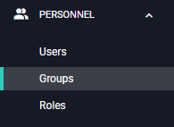

1. In the upper right-hand corner, click **Create Group**. The **Add group** window appears.

    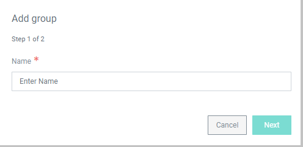

1. Enter a Name for the new Group and click **Next**.
1. On the **Group Membership** window, choose the Users to add to the group by **checking** the box next to each name. 

    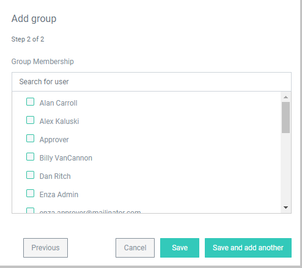

1. Click **Save** to create the Group. Click **Save and add another** to create the group and restart the process for another new Group.

## Managing Groups

To manage a group, click the **Group name** on the Groups page.

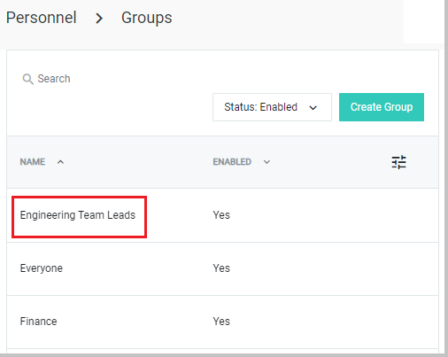

From the Manage Groups page, you can enable/disable the Group, add/remove Users, and add/remove Roles.

### Enable/Disable Group

**Enabling** a group will give the Group's permissions to Users in the Group. Groups are enabled by default.

**Disabling** a group will remove the permissions Users are given from membership in the Group. Disabling will **not** disable the Users, only their permissions from the Group.

* To **enable** a Group, click the green switch so the dot points to **Yes**.

    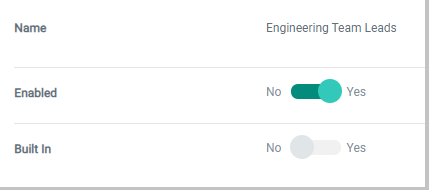

* To **disable** a group
    * Click the green switch so the dot points to **No**.
    * If the Group is attached to a Workflow Template, you will be given the option to **replace** the Group in the Workflow. Check the box next to the Group that will replace the Group you are disabling.
  
    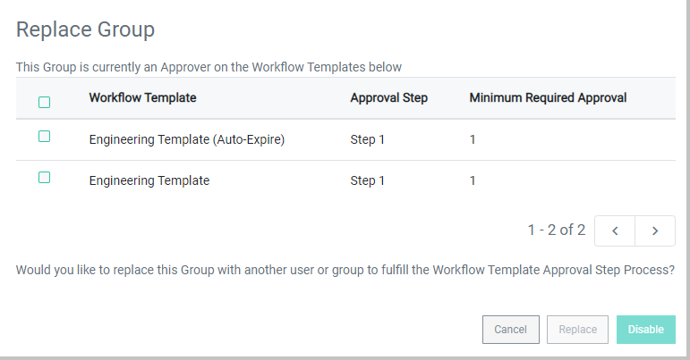

    * Click **disable**.

### Add/Remove Users

To manage Users within the Group, click the **Users** tab next to Manage Group.

    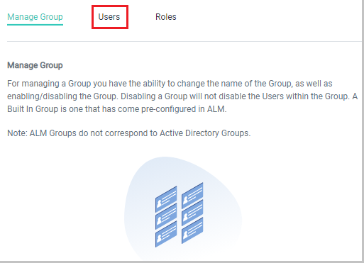

#### To add Users to the Group

1. Click **Add User** in the top-right corner.
1. On the **Add user** window, check the boxes next to the name(s) of Users to add to the group. 

    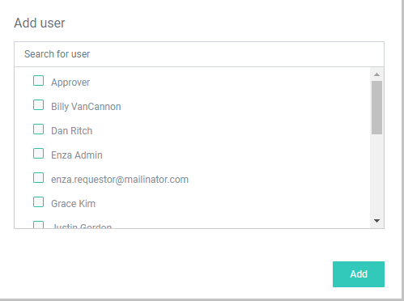

1. Click **Add**

#### To remove Users from the Group

* Click the **X** to the right of the User's name.

    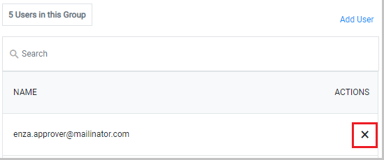

### Add/Remove Roles

To manage Roles within the Group, click the **Roles** tab next to Manage Group.

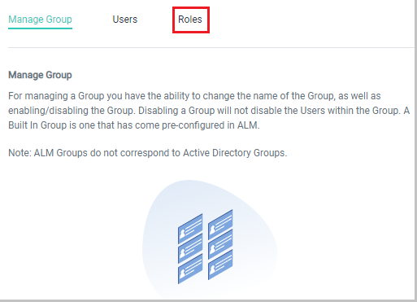

#### To Add Roles to the Group

1. Click **Add Role** in the top-right corner.
1. On the **Add role** window, check the boxes next to the Role(s) to give to the Users in the Group.

    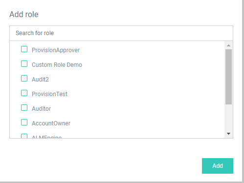

1. Click **Add**.

#### To Remove Roles from the Group

* Click the **X** to the right of the Role.

    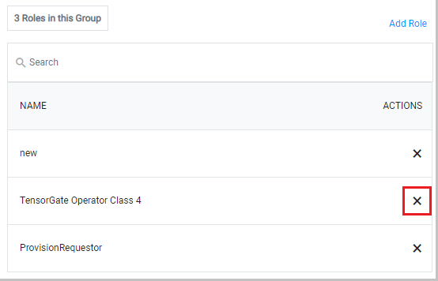
