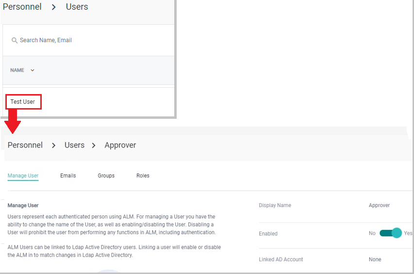

[title]: # (Create and Manage Users)
[tags]: # (Account Lifecycle Manager,ALM,Active Directory,)
[priority]: # (5100)

# Users

## Thycotic One accounts

Users log into ALM using their **Thycotic One** account. New Users can create an account at [Thycotic One](https://login.thycotic.com/Account/Login).

## Creating ALM Users

To create a new ALM User

1. On the left-hand navigation menu, open the **PERSONNEL** drop-down and click **Users**.

    

1. In the upper right-hand corner, click **Create User**. The **Add user** window appears.
    
    

1. Enter a **Display Name** and **Email** for the new user. Checking the **Trigger verification email** box will send the new User an email alerting them of the new account and asking them to verify their login before use.
1. Click **next** to continue to the **Groups** window.

    

1. Check the boxes of the Groups the new User belongs. By default, all Users belong to the *Everyone* group. Click **next** to continue to the **Roles** window.
1. Check the boxes next to the **Roles** to give the new User.
    
    

    >**Note**: Users automatically inherit Roles from the Groups they are assigned.

1. Click **Save** to create the User. Click **Save and add another** to create the User and then start the process over to create another new User.

## Managing Users

* Clicking on a User's **Display Name** from the User List will bring up the management page. You can edit a User's Roles, Groups, email and display name from the **Manage User** page.

    

### Change Display Name

* Click **Edit** to the right of the User's name to change their **Display Name**.

    * Enter the new name in the *Edit Display Name* window. Click **Update** for the change to take effect.

### Enable/Disable User

* Click **Disable** to revoke the user's access to ALM. You can return the User's permissions by clicking **Enable**.

### Add User email

* Click **Add email** to assign the User an additional address. Notifications for this User will be delivered to all listed addresses.

### Add/Remove User Groups

The Groups that the User belongs to are listed in the Group row.

To add a Group

* Click **Add group** to bring up a list of available groups.

    

* Check the boxes next to the new Group(s) for the User and click **Add**.

To remove a User from a Group

* On the right side of the Group name row, click  **Remove**.

### Add/Remove User Roles

The Roles that the User has are listed in the Role row.

To add a User Role

* Click **Add role** to bring up a list of available Roles. 

    

* Check the boxes next to the new Role(s) for the User and click **Add**.

To remove a User Role

* On the right hand side of the Role name row, click **Remove**.

### Link an Active Directory Account

To link the User to an AD Account

* On the right side of the Linked AD Account row, click **Locate AD Account** to bring up the *Set AD Account* window.
    

* Select a domain from the drop-down list and click **Set** to link the User's ALM and AD accounts.
