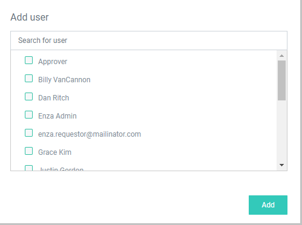

[title]: # (Create and Manage Roles)
[tags]: # (Account Lifecycle Manager,ALM,Active Directory,)
[priority]: # (5160)

# Create and Manage Roles

**Roles** control privileges within ALM. To access the Role page, click **Personnel** in the left-hand menu and then click **Roles**.

## Default Roles Provided by ALM

ALM supplies several default Roles, as in the following table, that your organization may find adequate or may use as models for its own Roles development.

> **Note**: Like ALM Groups, ALM Roles do **not** overlap with roles in Active Directory or other directory systems.

---
  
| Default ALM Role     | Permissions                                      | 
|----------------------|--------------------------------------------------|
| Account Owner        | Read managed Account                             |
|                      | Update managed Account
| Provision Requester  | Request a new Account                            |
| Provision Approver   | Approve Requests                                 |
| System Administrator | Authorize all Role types                         |
|                      | Create Workflow Templates                        |
|                      | Set up ALM Engines                               |
|                      | Perform ALM Integration with Active Directory    |
|                      | Perform ALM Integration with Secret Server       |

---

## Create Custom Roles

You can create custom Roles to further control access within ALM. 
To create a new Role

1. Click **Create Role** in the upper right-hand corner of the Role page.
1. Enter a **Name** for the new Role and click **Add** to bring up the **Manage Role** page.
1. Click **Add** to bring up the **Manage Role** page.
1. From the Manage Role page, select the **Permissions** tab. Assign permissions to the Role by checking the boxes next to the privileges the Role should have within ALM. **Settings will update as you check the boxes. You will not need to click apply or save.**
1. Select the **Users** tab and click **Add user** to bring up a list of available Users. Check the boxes next to the Users to assign to the Role and click **Add**.

    

1. On the **Groups** tab, click **Add group** to bring up a list of available Groups. Check the boxes next to the Groups that should include the Role and click **Add**.

## Manage Roles

Open the Role Management page by clicking on the name of the Role to be managed.
> **Note**: If you cannot find the Role you wish to manage, you may be viewing only enabled Roles. To filter Roles by All/Enabled/Disabled, click the **Status** drop-down and select the correct option.

### Change Role Permissions

* On the **Permissions** tab, assign permissions to the Role by checking the boxes next to the privileges the Role should have within ALM. **Settings will update as you check the boxes. You will not need to click apply or save.**

### Enable/Disable Role

* Use the toggle on the right side of the screen to enable/disable the Role. **Disabling** will **not** delete the Role. **Enabling** the role will restore permissions to the Users with this role.

### Automatically Apply to new Users

* Enabling **Automatically apply to new users** will assign this Role to **all** newly created Users. If you choose this option, **make sure that the permissions you give this Role are limited.**

### Add or Remove Users
To add Users to Role

1. Click the **Users** tab.
1. Click **Add Users** to bring up the Add user window.
1. Check the boxes next to the Users to be added to the Role.
1. Click **add** to confirm.
1. Remove Users by clicking the **X** to the right of the Username and confirming.

### Add Role to Groups
To add a Role to Groups
1. Click the **Groups** tab.
1. Click **Add Groups** to bring up the Add group window.
1. Check the boxes next to the Groups to be added to the Role.
1. Click **add** to confirm.
1. Remove Groups by clicking the **X** to the right of the Username and confirming. 