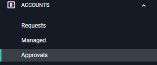
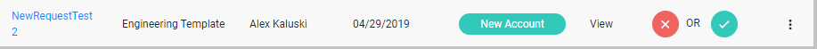

[title]: # (Approvals)
[tags]: # (Account Lifecycle Manager,ALM,Active Directory,)
[priority]: # (4000)

# Approving or Denying a Request

## Review New Requests

To see pending requests, use the left-hand menu to navigate to **ACCOUNTS** and click **Approvals**.

On the Approvals page, the pending requests are listed. 

* Click the **Name** of the request to see Account Details including the review interval, end-of-lifecycle action, directory server, and attributes. You can also access this menu by clicking the **three dots** on the right-hand side of the row and clicking **details**.

* To view the Requestor's reason for requesting the account, click **View** in the reason column. If the **Reason** field is blank, the Requestor did not provide a reason for requesting the account.

## Approve/Deny Requests

To approve a request

* Click the **green check mark** in the deny/approve column. Confirm the approval by clicking **Confirm**.
* Approving the request will provision the Service Account and notify the Requestor that their account has been approved. 

To deny a request

* Click the **red X** in the deny/approve column.
* Enter the **Reason** that the account is being denied and click **Deny**.
* Denying the request will notify the Requestor of the denial and the reason.
