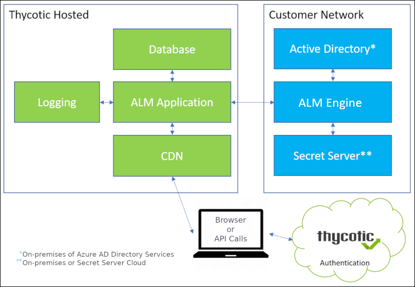

[title]: # (Service Architecture)
[tags]: # (Account Lifecycle Manager,ALM,Active Directory,)
[priority]: # (1100)

# Service Architecture

ALM’s service architecture centers on a Windows Service called the ALM Engine.

* Running as a suitably privileged Windows Service on your organization’s hardware, the ALM Engine manages interactions among ALM’s cloud service components and aspects of your enterprise infrastructure, such as Active Directory and Secret Server—whether these be on premises, or cloud located like ALM.

The [Getting Started](../get-started/) section provides detailed information on [setting up the ALM Engine](../get-started/setup-alm-engine/).

  

  
