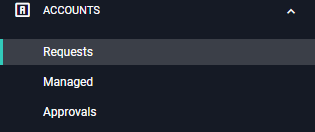

[title]: # (Requests)
[tags]: # (Account Lifecycle Manager,ALM,Active Directory,)
[priority]: # (3000)

# Requesting A Service Account

1. On the left-hand menu, click **ACCOUNTS** and then click **Requests**.

    

1. Click **New Request** in the upper right-hand corner to open the New Request window.
1. Select the **Workflow Template** that matches the Service Account you are requesting from the drop-down menu. If the Template contains **Terms of Service**, you must check the box acknowledging that you have read and agreed to the terms. Click **Next**.
1. Supply an **Account Name** and click **Submit**. 
    >**Note**: If the Administrator has enabled **regex** on the workflow template, then the name you choose must conform to the set parameters.
1. These fields will populate automatically: Account Type, Service Account, Workflow, End-of-Lifecycle Action, Vault Name, Active Directory Server, OU Distinguished Name, Group, and Account Owners. These fields cannot be changed.
1. Choose an End-of-Life **Interval** from the drop-down menu. At the end of the interval period, ALM will automatically perform the listed End-of-Lifecycle action. The intervals listed were made available by the creator of the Workflow Template.
1. Supply a **Justification/Reason** for the creation of the account. The Approvers will be given this information.
1. Supply a **Description** of the Service Account that you are requesting.
1. In the **Active Directory Attributes** rows, provide any **values** that are required.
1. Review the **Approval Steps** at the bottom of the page. It displays a list of Approvers available and the number required.
1. At the top of the page, click **Submit**. Your request will be sent to the Approvers for review. You can also **Save the Draft** to complete it later or **Delete the Request**.

## Withdraw a Request

To withdraw a request
* Navigate to the Requests page and click on the request.
* Click **Delete Request** and click **OK** to confirm.