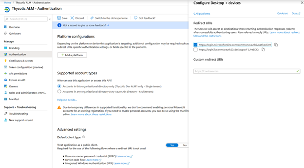
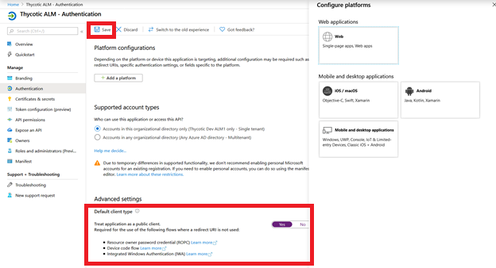
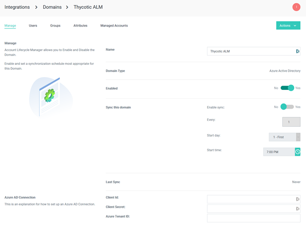

[title]: # (Integrate Azure AD)
[tags]: # (Account Lifecycle Manager,ALM,Active Directory,Azure, Azure AD)
[priority]: # (5140)

# Integrate ALM with Azure Active Directory

Use these steps to integrate ALM with Azure Active Directory:

Navigate to External Domains > Add Domain.

* Select Azure Active Directory in the left-hand navigation, then select App registrations under Manage.

* Select New registration. On the Register an application page, set the values as follows.
    * Set Name: (Thycotic ALM)
    * Set Supported account types to: Accounts in this organizational directory only – (Single tenant)
    * Leave Redirect URI empty.

* Select Register. On the Thycotic ALM App Registration page, copy the value of the Application (client) ID and (tenant) ID and save it
 

* Select the Add a Redirect URI link. On the Redirect URIs page, locate the Add Platform and select (Mobile and  desktop applications) section. Select the https://login.microsoftonline.com/common/oauth2/nativeclient URI. Click Configure.
 
 
 
 

* Locate the Default client type section and change the Treat application as a public client toggle to Yes, then choose Save. 

 

* Select Certificates and secrets
    *Click new client secret and name whatever (ALM)
    *Copy the client secret for later
 

* Select API Permissions in the Left Nav
    * Select Add Permissions
    * Select Microsoft Graph
    * Add following permissions:
        * Delegated Permissions
            * Directory.AccessAsuser.All
        * Application Permissions
            * Domain.ReadWrite.All
            * Group.Read.All
            * Group.ReadWrite.All
            * Group.Selected
            * User.Read.All
            * User.ReadWrite.All

* Select Grant admin consent

* Switch over to ALM and enter the client, secret, and tenant ID in the created Azure AD Domain
 
 