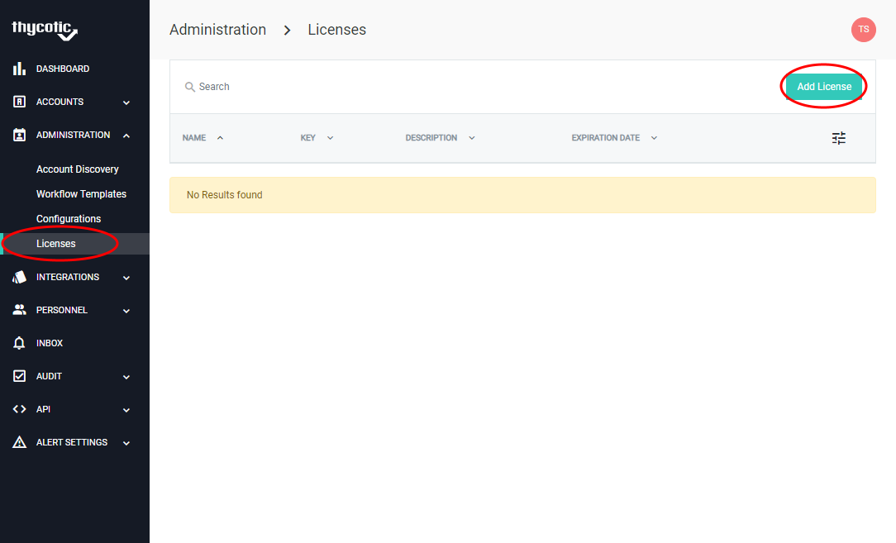
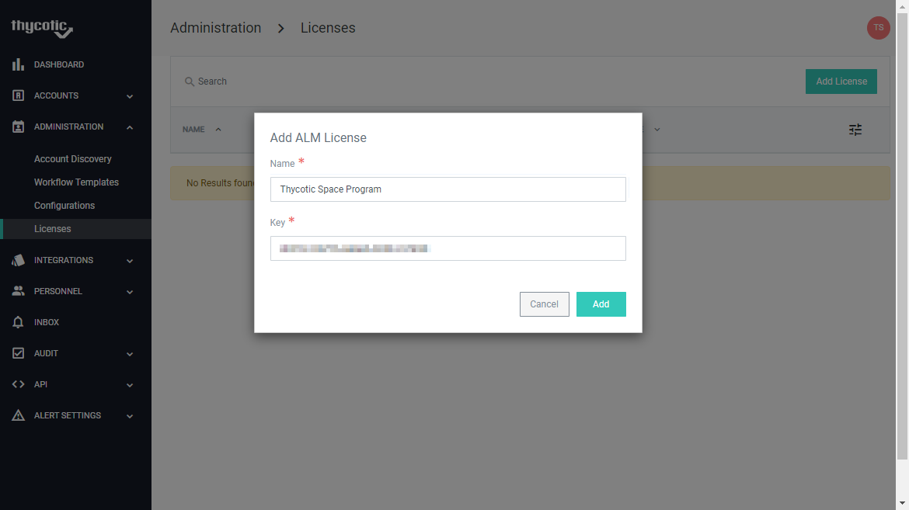

[title]: # (Self-Hosted Account Lifecycle Manager)
[tags]: # (Account Lifecycle Manager,ALM,Active Directory,on-premise,on-prem,self hosted)
[priority]: # (104)


# Prerequisites

The following are required to install the self-hosted version of ALM:

## Linux machine

To host docker and ALM.  At this time, we do not recommend testing with Windows and WSL.

* Instructions for enabling Hyper-V: https://docs.microsoft.com/en-us/virtualization/hyper-v-on-windows/quick-start/enable-hyper-v

* Instructions for setting up Ubuntu 18.04 Enhanced Mode VM: https://www.hanselman.com/blog/UsingEnhancedModeUbuntu1804ForHyperVOnWindows10.aspx

  * The 18.04 version supports “enhanced mode”, which runs a lot smoother and syncs the clipboard with the host OS.  This makes copy/pasting commands much easier.  Microsoft hasn’t updated the setup script to handle 20.04 yet.

  * The virtual network switch that the VM is connected to must be configured as “External Network” with the network adapter you use selected in the dropdown and “Allow management operating system to share this network adapter” checked.

##Docker 

Manages the images and containers used by ALM.

* Installation Instructions : https://docs.docker.com/get-docker/

##Docker Compose 

This is required for ALM’s installation script to manage the local orchestration of services.

* Installation instructions: https://docs.docker.com/compose/install/

## Port Configuration

After installation, the docker containers will require the following ports to be available on the host system:

* TCP/80, if LetsEncrypt certificate management is enabled.

* TCP/443 for the web UI.

## Additional Requirements

During installation and configuration, you will need to know the following ahead of time:

* **Domain** (Example: alm.thycotic.com)
  * Site where ALM will accessible to users through a web browser.
* **SSL/TLS Certificate for the domain** 
  * Can be manage automatically using LetsEncrypt, as an option.
  * Or a certificate and chain can be provided manually during setup.
* **Open ID Connect (OIDC) credentials**
  * ALM uses OIDC for user authentication.
  * This can be configured through Azure Active Directory or your preferred OIDC provider.

* **SMTP credentials** (optional) - Allows ALM to send email notifications to users.  If you choose to not use SMTP, put in any values for the questions and please understand email notifications will not be sent in ALM.


# Docker Configuration

Once Docker has been installed, add your user to the docker group. This allows the ALM setup script to run docker commands without sudo:

```
sudo groupadd docker
sudo gpasswd -a $USER docker
sudo service docker restart
```


# Installation

Create a directory for the ALM data to be stored.
```
mkdir ~/alm
```
NOTE: This directory will contain configuration files for ALM.  Permissions should be set to only necessary users. (e.g. the account that installed ALM, an account used for running backups, etc.)

## Change to that directory.

```
cd ~/alm
```

## Download and Install the Script:

```
curl https://alc-cdn01.azureedge.net/scripts/alm.sh -o alm.sh && chmod +x alm.sh && ./alm.sh install
```

##Domain name

```
What domain name will users use to access ALM?
```

To use LetsEncrypt, you’ll need a domain name that points to your public IP, and ports 80 and 443 forwarded from your router to the local IP of the VM that is running ALM.

## SSL/TLS Configuration 

```
--- SSL/TLS Configuration ---
ALM requires a SSL/TLS certificate to ensure that all web communication is secure.
ALM can be configured to use LetsEncrypt to automatically create and manage the certificate.
Or you may provide your own.

Would you like to use LetsEncrypt to generate an SSL/TLS certificate for docker.enzadev.com? [y/n]:
```
```y``` will pull the ```certbot``` container and attempt to get a certificate for the domain entered in the previous step.  The acquired certificates will be under ```./almdata/letsencrypt```

```n``` will wait for you to copy the certificate (named ```<DOMAIN>.crt```, *e.g.* ```default.local.enzadev.com.crt```) and private key (named ```<DOMAIN>.key```, *e.g.* ```default.local.enzadev.com.key```) to the same folder as the install script.  It will move them to the ```./almdata/ssl``` directory as part of the install.  

## Database Configuration

```
--- Database Configuration ---
ALM needs to set up a SQL Server database to store its data.
You can use your own SQL Server instance to host the database, 
or you may choose to have a SQL Server Express instance set up automatically as a container.

Do you want to automatically set up your database in a SQL Express container? [y/n]:
``` 
```y``` will generate credentials and move on to the next step

```n``` will prompt you for the connection info for SQL Server.  
```
  Enter the connection info for your SQL Server:
  Server:
  Database:
  User ID:
  Password:
```
## Admin User
```
--- Admin User ---
ALM requires at least one admin user.  We will configure the first admin user as part
of the installation process. This admin user will also receive email alerts regarding
LetsEncrypt certificate expirations.
Initial User Display Name: 
Initial User Email:
``` 
These are the values that will be used for the initial admin account.  Make sure you use an account that can log into the OIDC instance below.

## Authentication Configuration
```
--- Authentication Configuration ---
ALM requires an OpenID Connect (OIDC) provider for user authentication. Please provide
the credentials to your preferred OIDC provider.
OIDC Authority URL: 
OIDC Client ID: 
OIDC Client Secret: 
```
NOTE: The domain you use will need to be configured as a reply url in whatever OIDC provider you use, or you will get an “invalid reply url” error when you try to log in.

## Email Configuration
```
--- Email Configuration ---
ALM uses SMTP to send email notifications to users. Please provide the SMTP credentials
to your preferred provider.
Server: 
Port: 
Use SSL?:
Use Credentials?:
(If yes, then:)
  Domain:
  User Name:
  Password:
```
NOTE: Use these settings to connect to an SMTP server. These do not need to be valid to complete the install

# Finishing Setup and Adding Licenses

Once the setup is complete, browse to your ALM instance using the chosen domain name. 

When running in Self Hosted mode, ALM requires license keys to add more than one user and one ALM Engine. 

##Navigate to Licensing page

Open Administration > Licenses in the left navigation menu

Click Add License


 

Users and engines are licensed separately, so two licenses will need to be entered.



At this step setup is complete, you will now have ability to add multiple and users depending on allowances of the license. 