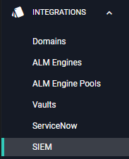
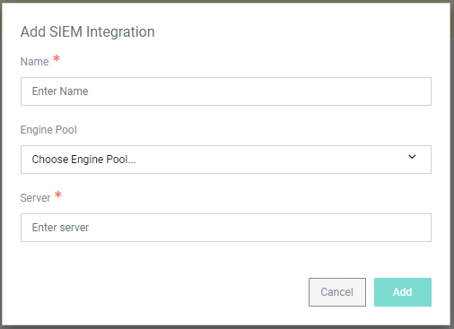
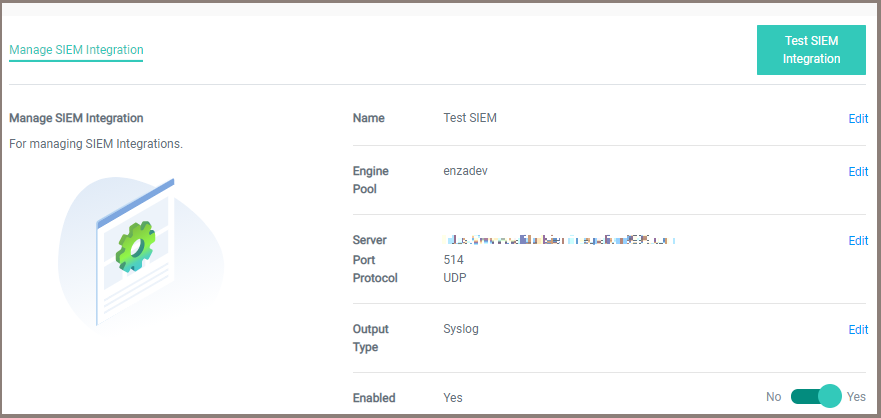

[title]: # (Integrate with SIEM)
[tags]: # (Account Lifecycle Manager,ALM,SIEM)
[priority]: # (5200)

# SIEM Integration

ALM supports integration with security information and event management (SIEM) tools.

## Setup a SIEM Integration

To create a new integration:

1. Click **INTEGRATIONS** on the left-hand navigation menu and select **SIEM**.

    
1. Click **Create SIEM Integration** in the top right-hand corner to bring up the **Add SIEM Integration** window.

    
1. Enter a **Name** for the integration.
1. Choose an **Engine Pool** for the integration. 
1. Enter the **Server URL** where ALM will send data.
1. Click **Add** to bring up the **Manage SIEM Integration** page.

    
1. On the Manage SIEM Integration page, click **Edit** to change the values for each section.
    > **Note**: The **Port** and **Protocol** automatically fill with default values. Make sure to change the values to match your server settings. The **Output Type** defaults to Syslog. It can be changed to JSON or CEF.
1. Set the **Enabled** toggle to **Yes** to activate the SIEM integration.
1. When the integration is configured, click **Test SIEM Integration** in the upper right-hand corner. Clicking will immediately send ALM data to your chosen server. 