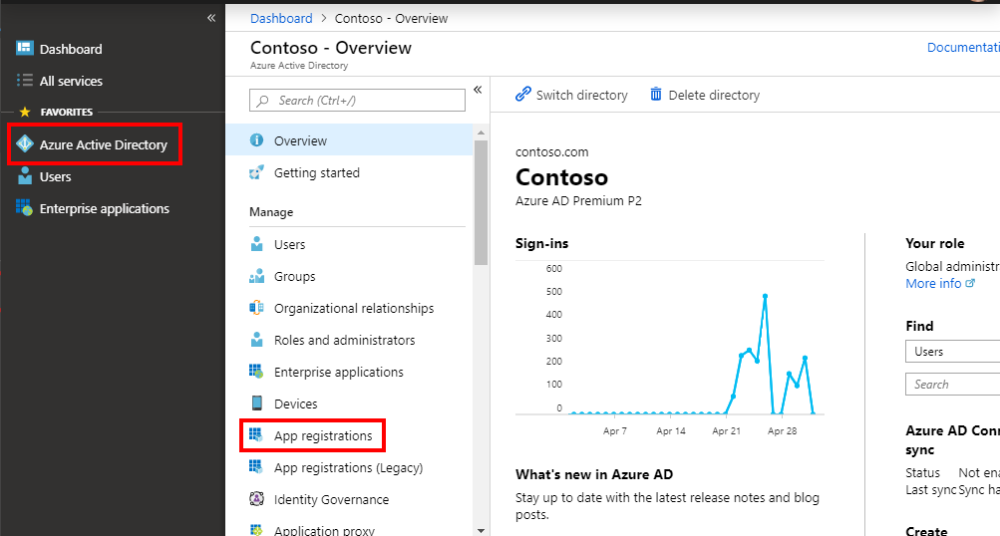
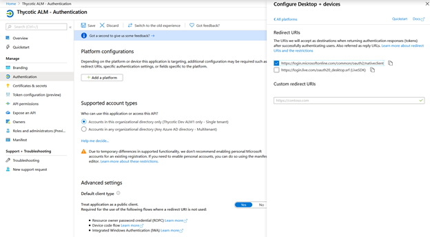
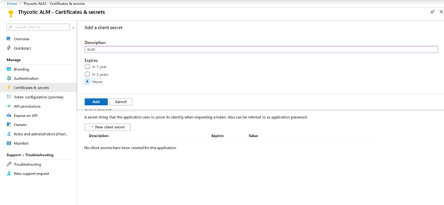
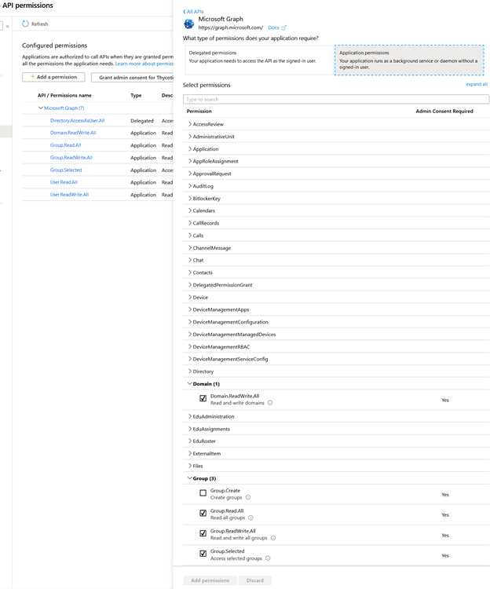
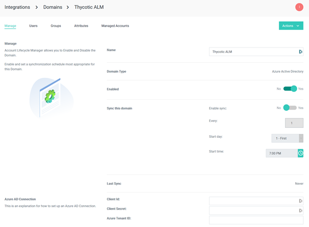

[title]: # (Integrate Azure AD)
[tags]: # (Account Lifecycle Manager,ALM,Active Directory,Azure, Azure AD)
[priority]: # (5140)

# Integrate ALM with Azure Active Directory

Use these steps to integrate ALM with Azure Active Directory:

1. Open a browser and navigate to the Azure Active Directory admin center.
1. Select Azure Active Directory in the left-hand navigation, then select App registrations under Manage.

    

1. Select New registration. On the Register an application page, set the values as follows.
    * Set Name: (Thycotic ALM)
    * Set Supported account types to: Accounts in this organizational directory only – (Single tenant)
    * Leave Redirect URI empty.

      

1. Select Register. On the Thycotic ALM App Registration page, copy the value of the Application (client) ID and (tenant) ID.

    

1. Select the Add a Redirect URI link. On the Redirect URIs page, locate the Add Platform and select (Mobile and  desktop applications) section. Select the https://login.microsoftonline.com/common/oauth2/nativeclient URI. Click Configure.

    
    

1. Locate the Default client type section and change the Treat application as a public client toggle to Yes, then choose Save.

    

1. Select Certificates and secrets
    
    * Click new client secret and name whatever (ALM)
    * Copy the client secret for later

        

1. Select API Permissions in the Left Nav
    * Select Add Permissions
    * Select Microsoft Graph
    * Add the following permission options:
        * Delegated Permissions
          * Directory.AccessAsuser.All
        * Application Permissions            
          * Domain.ReadWrite.All
          * Group.Read.All
          * Group.ReadWrite.All
          * Group.Selected
          * User.Read.All
          * User.ReadWrite.All
          * RoleManagement.Read.All
          * RoleManagement.Read.Directory
          * RoleManagement.ReadWrite.Directory

        

1. Select Grant admin consent
1. Switch over to ALM
    * navigate to **Integrations**
    * Select **Domains** from list
    * Select **Add Domain**
    * Enter a **Name** for the Domain
    * From the **Domain Type** dropdown, select **Azure Active Directory**
    * Select **Edit** from the **Actions** menu
    * *Optional* Enable and configure domain synchronization
    * Enter the client, secret, and tenant ID in the created Azure AD Domain
    * Select **Save** from the **Actions** menu
 
  

## Optional: Use these steps to enable **Sync**:

* in ALM, navigate to the **Domains** page
* select a **Domain** for which you want **Sync** enabled 
* on the **Manage** tab of of the **Domains** detail page,
  * use the **Actions** button
  * select **Edit**
  * locate the **Sync** tool (in the lower half of the **Manage** tab)
* set the **Enable Sync** toggle to **Yes**
* Set the desired sync frequency
Review your work. To commit the configuration, return to the **Actions** button at the top of the page and select **Save**.
