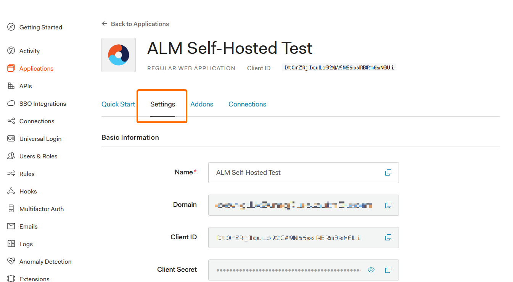
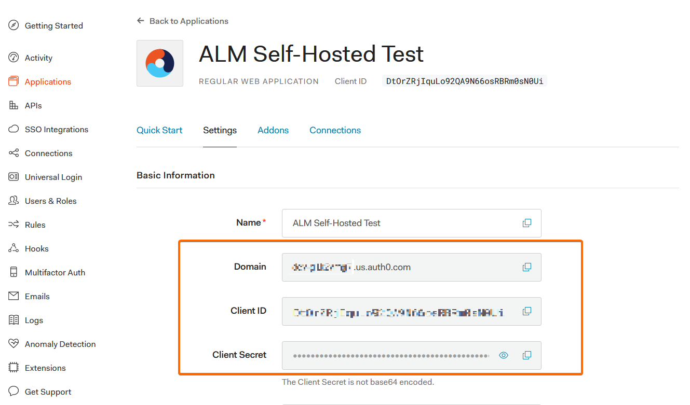

[title]: # (Auth0 Configuration)
[tags]: # (Account Lifecycle Manager,ALM,Active Directory,on-premise,on-prem,self hosted,auth0)
[priority]: # (3540)

# Configure Auth0 Open ID Connect (OIDC)

## Create An Application in Auth0

The Auth0 application will allow for authentication with ALM.

1. Sign into [Auth0](https://auth0.com) or create an account.
1. Navigate to **Applications**

    

1. Click **Create Application**.
    * Provide a **Name**.
    * Under **Choose an application type** select **Regular Web**.
    * Click **Create**.
    
    

## Copy Domain/Client ID/Client Secret

After the application is created, find and copy the values that will be needed during the ALM setup.

1. Select the **Settings** tab.
1. Under **Basic Information**, make note of the following:
    * **Domain**- This will be the OIDC Authority URL value during setup.
    * **Client ID**
    * **Client Secret**

    
    

## Configure Settings 

While in the Settings section, configure the settings that are specific to your self-hosted instance.

1. Scroll down to the **Applications URIs** section and fill out the following fields
    * **Application Login URI** - ```https//{{your ALM Domain}}```
    * **Allowed Callback URLs** - ```https://{{your ALM Domain}}/signin-oidc,https://{{your ALM Domain}}/signout-callback-oidc```
    * **Allowed Logout URLs** - ```https://{{your ALM Domain}}/authentication/logout```
    

1. Scroll to the bottom of the page and click **Save Changes.**
