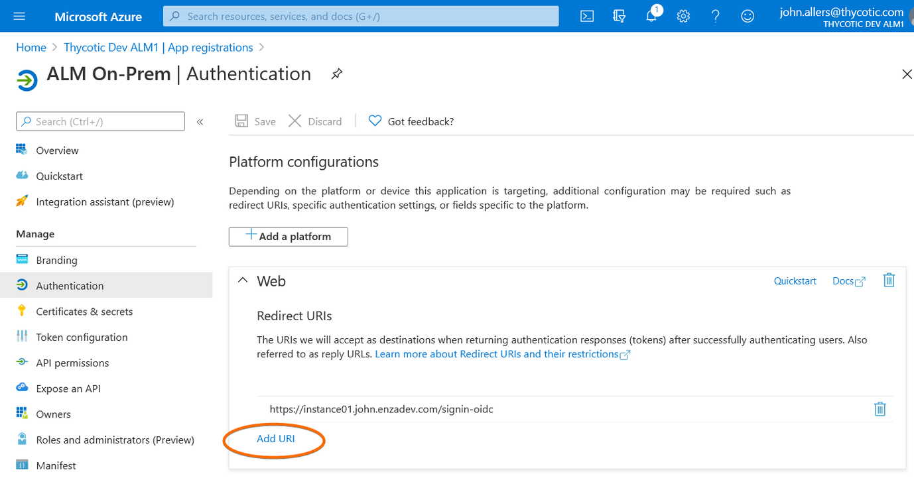

[title]: # (Azure AD Open ID Connect)
[tags]: # (Account Lifecycle Manager,ALM,Active Directory,on-premise,on-prem,self hosted,oidc)
[priority]: # (4600)

# Azure AD Open ID Connect

To configure Azure AD OIDC with ALM:

## Create a New App Registration

1. Navigate to [portal.azure.com](https://portal.azure.com) and then **Azure Active Directory**.

    

1. In the left-hand navigation panel, select **App registrations**.

    

1. On the top of the App registration page, click **+New registration**.

    

1. On the **Register an application** page, provide:
    1. Name- the name you would like for ALM. (*Example: ALM On-Prem*)
    1. Supported account types- choose single tenant (default).
    1. Redirect URI- set the drop-down to **Web** and provide the sign-in URL for your ALM instance.
1. Click **register**. You will be taken to the newly created App registration page.

    

1. On the registration page, take note of the **Application (client) ID value**. This will be used for the **OIDC Client ID** value during ALM setup.

    

## Configure OIDC URLs

1. On the top of the registration page, click **Endpoints**. The endpoints dialogue will open.

    

1. Copy the **OpenID Connect metadata document** value, but omit the *v2.0/well-known/openid-configuration* portion of the URL. This will be the **OIDC Authority URL**.

    

1. Close the Endpoints dialogue.
1. On the left-hand navigation menu, click **Authentication**. The Platform configurations panel will open.

    

1. Under Web, click **Add URI**.

    

1. Enter https://YOUR_ALM_DOMAIN/signout-callback-oidc.

    

1. On the top of the panel, click **Save**.

## Create Client Secret

1. In the left-hand navigation menu, click **Certificates & secrets**. The Certificates & secrets panel will open.

    

1. Under Client secrets, click **New client secret**.

    

1. On the **Add a client secret** dialog, choose:
    1. A description. (*Example: ALM OIDC Credentials*)
    1. An expiration date. **When this secret expires, ALM will need to be reconfigured with manually with a new secret**.
1. Click **Add** to save the new client secret.

    

1. The new secret will now be displayed in the Client secrets section of the Certificates & secrets page. 
1. Click the **Copy to clipboard icon** and store the secret value. It will be used as the OIDC Client Secret during ALM setup.

    

1. The OpenID connect configuration for Azure AD is now ready for use with ALM.