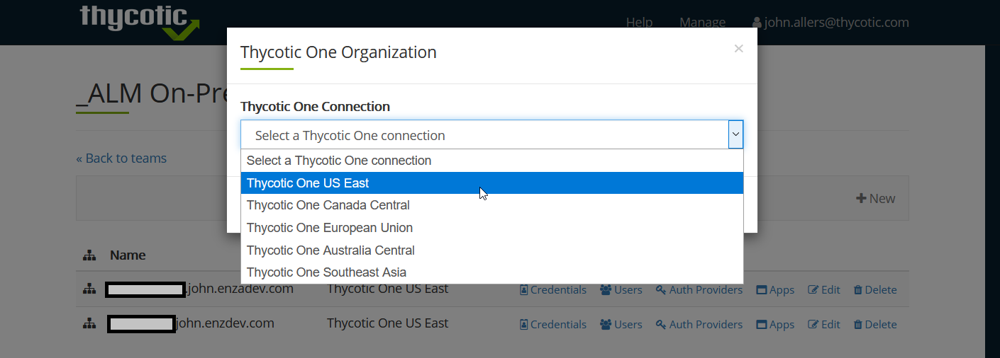

[title]: # (Thycotic One Open ID Connect)
[tags]: # (Account Lifecycle Manager,ALM,Active Directory,on-premise,on-prem,self hosted,oidc)
[priority]: # (4601)

# Thycotic One Open ID Connect (OIDC) Configuration

To configure Thycotic One OIDC authentication for use with ALM:

## Select a Team

1. Navigate to [portal.thycotic.com](https://portal.thycotic.com)
1. On the top menu, click **Manage** and then **Teams**.

    

1. If there are no existing teams, create one by clicking **+New**. Give the Team a name and click **Save Changes**.

    

## Create a New Organization

1. To the right of the team name, click **Organizations**.

    

1. On the organizations page click **+New**.

    

1. From the drop-down, select the Thycotic One region that you would like to use.

    

1. On the organization preferences page, you can configure the following options:
    1. The **Name** of the organization.
    1. The **Thycotic One Connection Region**.
    1. The **lockout attempt count**. This will determine the number of failed logins before a user is locked out.
    1. The **minimum password strength**. This will determine the complexity of passwords that users must use for logging in.
    1. The **Two-Factor Login Policies**. Leaving the drop-downs at **No Preference** will allow users to choose their two-factor method.
    
    

1. Once your configuration is complete, click **Save**.

## Configure OIDC Credentials

1. On the organizations page, click **Credentials** next to the organization you created.

    

1. Click **+New**.
1. Complete the **Organization Credential** form:
    1. Give the credential a name.
    1. The **Post-Login redirect URIs** should be: https://**YOUR_ALM_DOMAIN**/signin-oidc
    1. The Post-Logout Redirect URIs should be: https://**YOUR_ALM_DOMAIN**/signout-callback-oidc
    >**NOTE**: Be sure to save the **Endpoint**, **Client Id**, and **Client Secret**. You will need these values when performing ALM Self-Hosted setup.

    

    1. Click **Save**.
1. OpenID Connect configuration for Thycotic One is now complete and ready for use with ALM.
