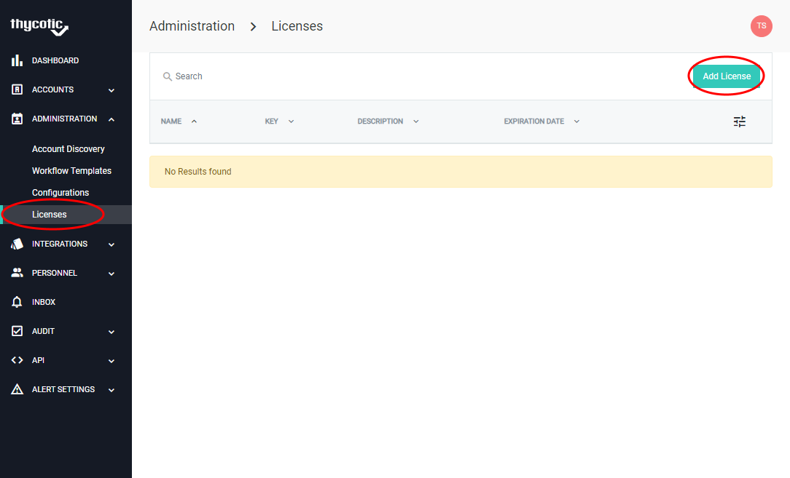
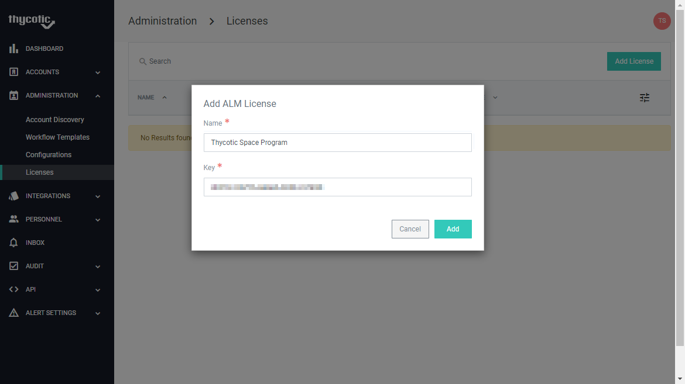

[title]: # (Finish and Add Licenses)
[tags]: # (Account Lifecycle Manager,ALM,Active Directory,on-premise,on-prem,self hosted,license)
[priority]: # (4530)

# Finishing Setup and Adding Licenses

Once the setup is complete, browse to your ALM instance using the chosen domain name.

When running in Self Hosted mode, ALM requires license keys to add more than one user and one ALM Engine.

## Navigate to Licensing page

Open Administration > Licenses in the left navigation menu

Click Add License

 
Users and engines are licensed separately, so two licenses will need to be entered.

At this step setup is complete, you will now have ability to add multiple users and ALM Engines depending on allowances of the license.
