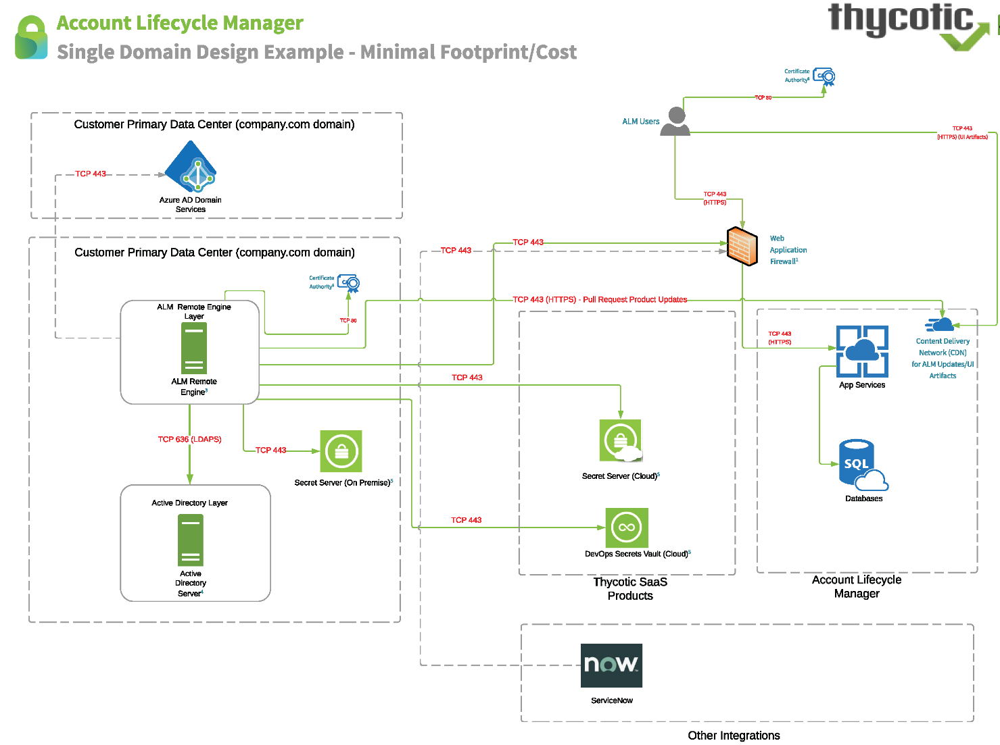
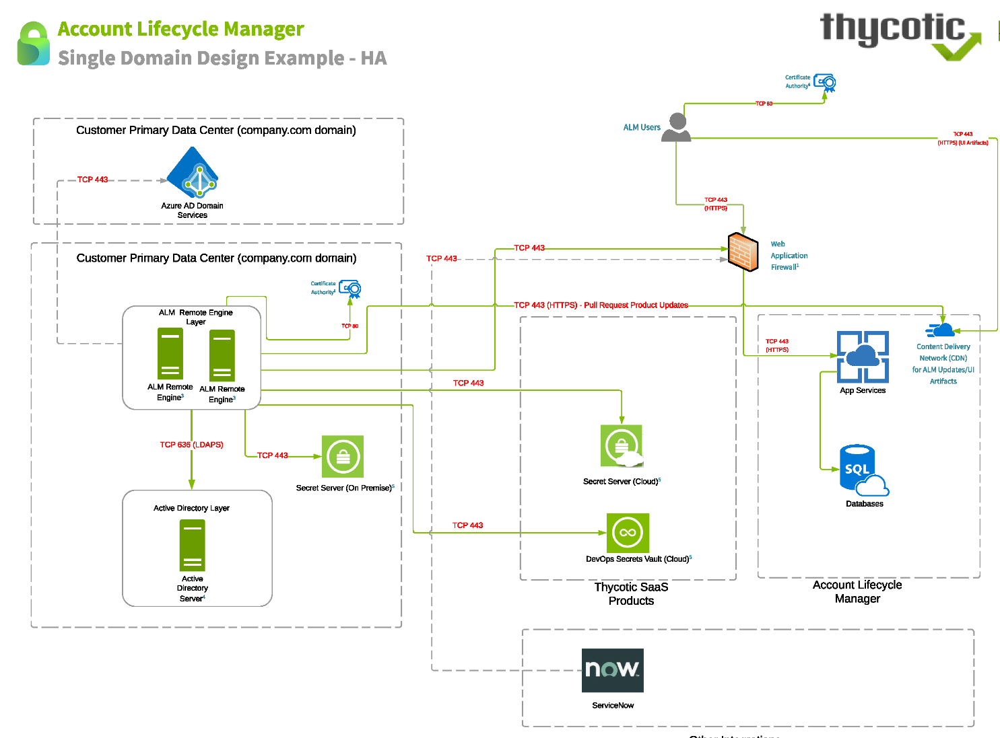
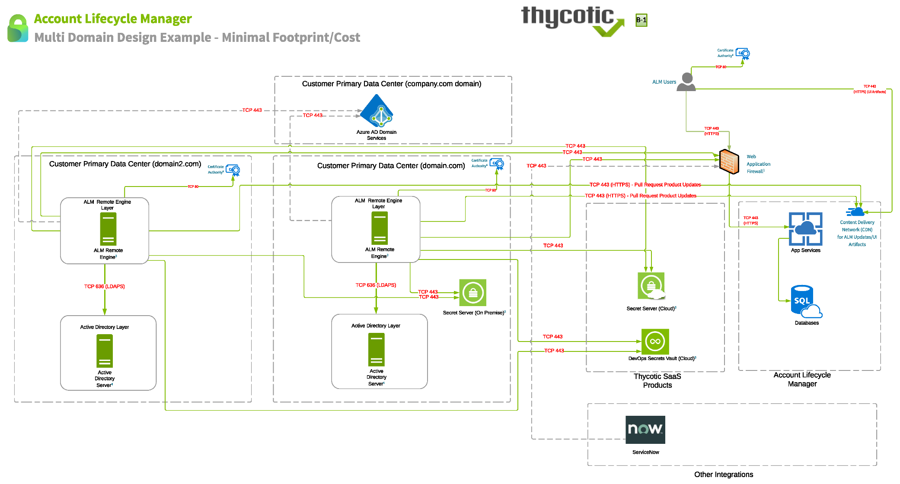
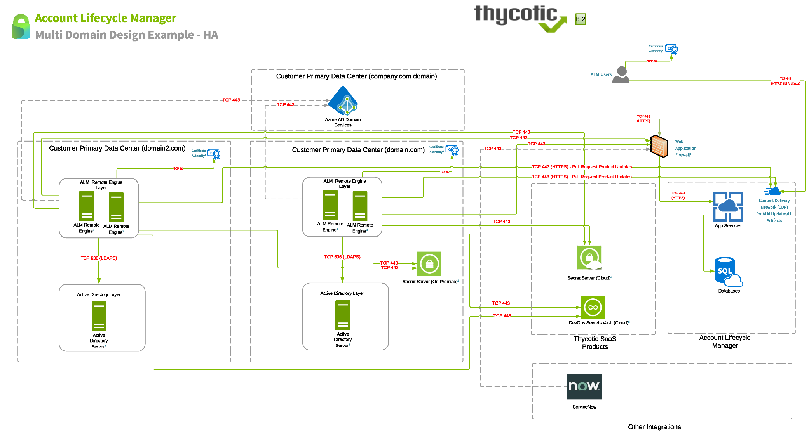
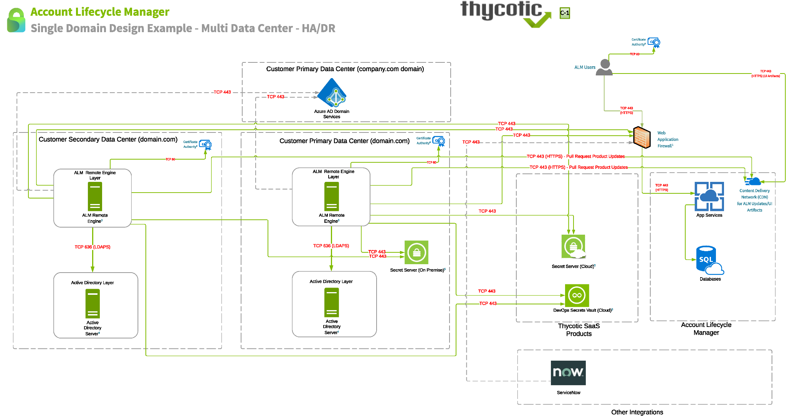
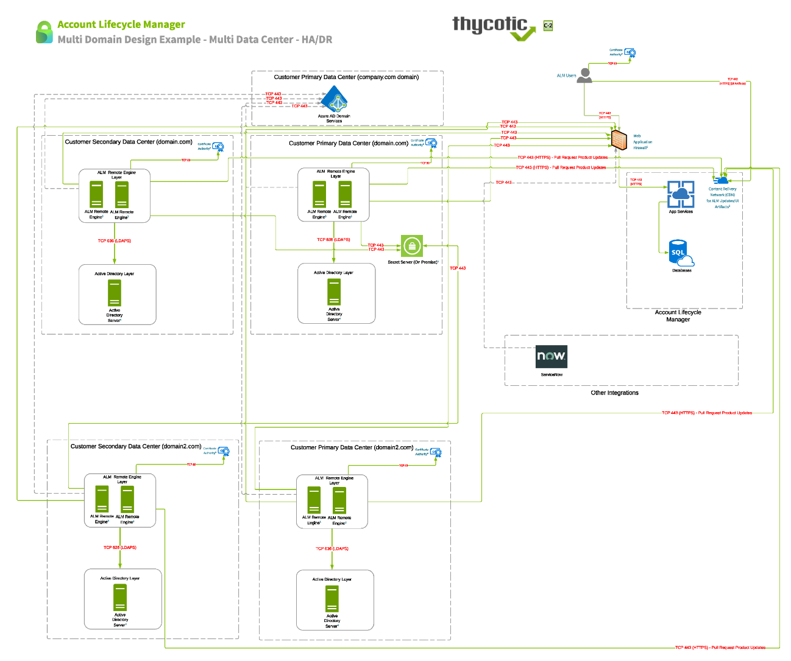

[title]: # (Service Architecture)
[tags]: # (Account Lifecycle Manager,ALM,Active Directory,)
[priority]: # (8000)

# Service Architecture

ALM’s service architecture centers on a Windows Service called the ALM Engine.

Running as a suitably privileged Windows Service on your organization’s hardware, the ALM Engine manages interactions among ALM’s cloud service components and aspects of your enterprise infrastructure, such as Active Directory and Secret Server—whether these be on premises, or cloud located like ALM.

* ALM is deployed to the following Azure datacenter regions:
    * US-East
    * EU-West
    * AU-Central

**Component Definitions**

Account Lifecycle Manager - Provide a cloud app design and intuitive UI as a front end to Active Directory
allowing enterprise IT users to more reasily and efficiently request, approve, privilege, manage, and retire service
accounts by delegating the Active Directory intricacies to the cloud app.

*Thycotic Identity One* - These are the accounts that are used to provision User access to your ALM instance. Thycotic one accounts are used in some of our other products as well. This is not pictured in the architectural
diagram as it is contained as part of the ALM sign on process.

*ALM Remote Engine* - The ALM engine is a Windows Service that runs on your organization's hardware. It
manages interactions between the ALM cloud service and your Active Directory installation. It also supports ALMs
integration with your organizations Secret Server/DSV Instance. This includes support for integration with:
* Secret Server On Premise Installation
* Secret Server Cloud
* DevOps Secrets Vault

The [Getting Started](../get-started/) section provides additional information on [setting up the ALM Engine](../get-started/setup-alm-engine/).

*App Services* - These are shared resources between multiple customers

*Databases* - These are customer independent for each ALM instance

*Active Directory Server* - This is the active Directory Server you intend to integrate the ALM Remote Engine with. Please note that relationships between a ALM Remote Engine to a domain within your environment is a 1:1
mapping. This implies that ALM Remote Engines can only manage one domain at a time.

*Integrations* - Currently there are additional integrations for Azure AD and ServiceNow that are pictured in the
reference architecture
