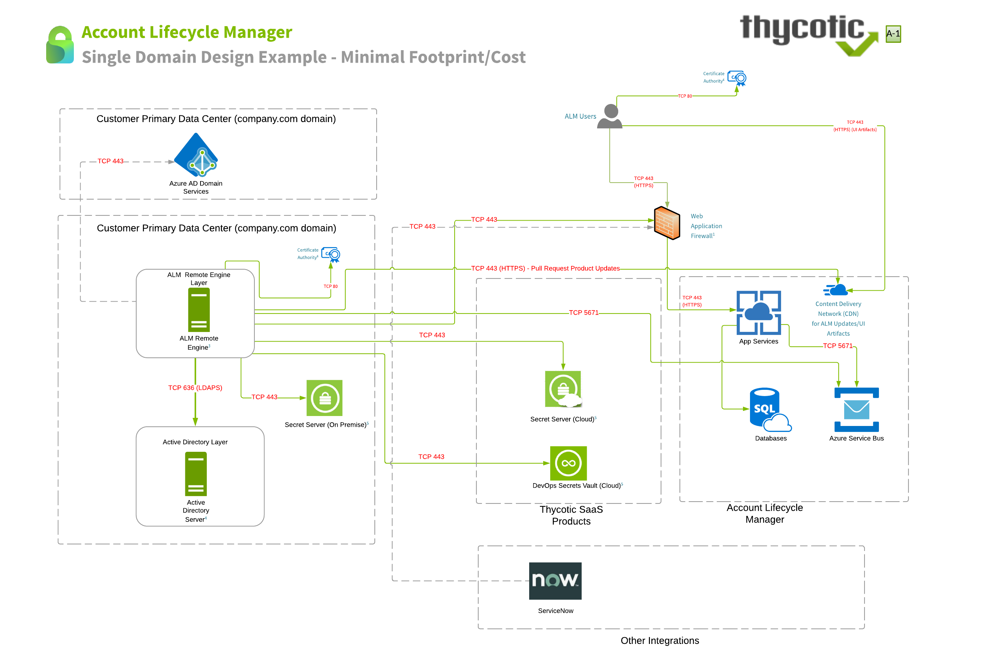
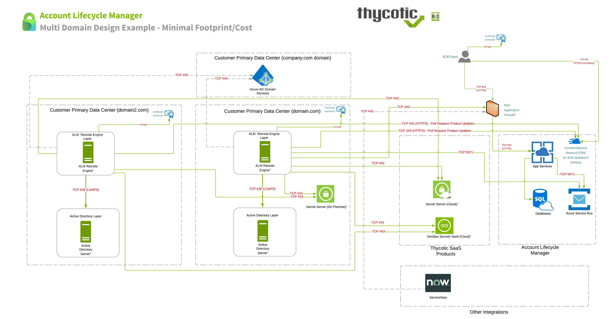
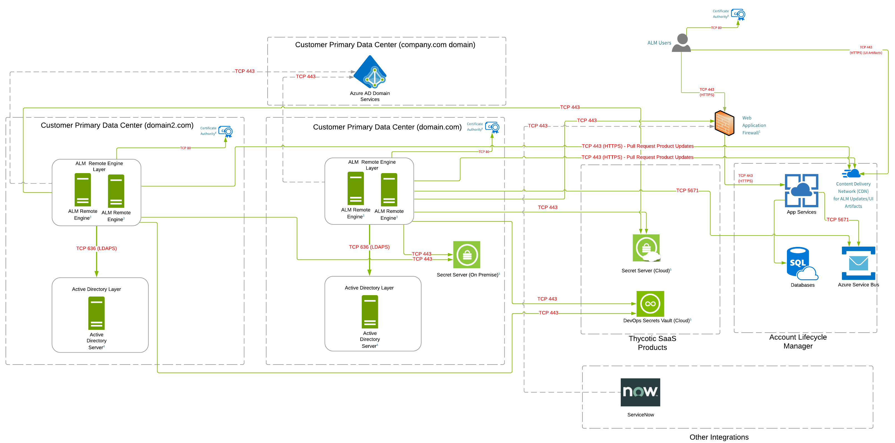
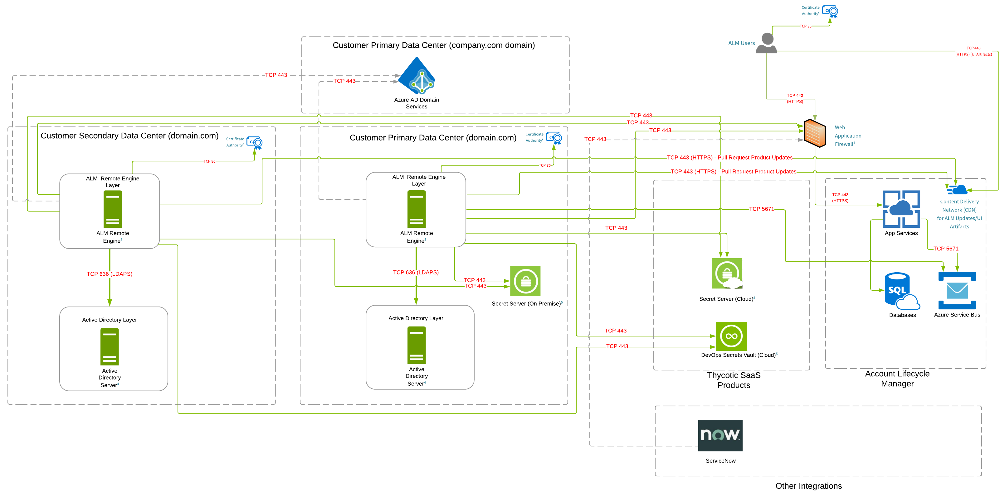
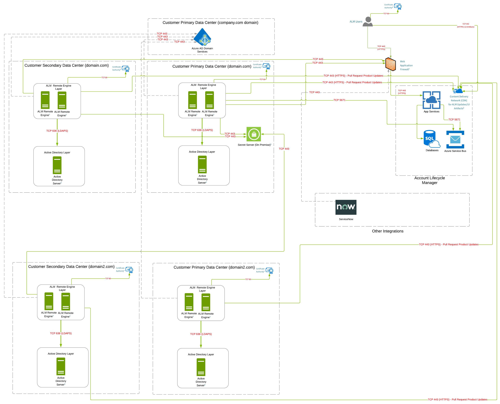

[title]: # (Service Architecture)
[tags]: # (Account Lifecycle Manager,ALM,Active Directory,)
[priority]: # (8000)

# Account Lifecycle Manager Architecture Diagrams

## Component Definition

**Account Lifecycle Manager** - Provide a cloud app design and intuitive UI as a front end to Active Directory allowing enterprise IT users to more reasily and efficiently request, approve, privilege, manage, and retire service accounts by delegating the Active Directory intricacies to the cloud app. 

**Thycotic Identity One** - These are the accounts that are used to provision User access to your ALM instance. Thycotic one accounts are used in some of our other products as well. This is not pictured in the architectural diagram as it is contained as part of the ALM sign on process.

**ALM Remote Engine** - The ALM engine is a Windows Service that runs on your organization's hardware. It manages interactions between the ALM cloud service and your Active Directory installation. It also supports ALMs integration with your organizations Secret Server/DSV Instance. This includes support for integration with:
* Secret Server On Premise Installation
* Secret Server Cloud
* DevOps Secrets Vault

**App Services** - These are shared resources between multiple customers 

**Databases** - These are customer independent for each ALM instance 

**Active Directory Server** - This is the active Directory Server you intend to integrate the ALM Remote Engine with. Please note that relationships between a ALM Remote Engine to a domain within your environment is a 1:1 mapping. This implies that ALM Remote Engines can only manage one domain at a time.

**Integrations** - Currently there are additional integrations for Azure AD and ServiceNow that are pictured in the reference architecture

## Cloud Deployment Network Configuration

1. Web Application Firewall (WAF): IP Address whitelisting is not necessary unless outbound firewall rules are in place. Public IP is based on geographical location. 
    * All regions: 45.60.38.37, 45.60.40.37, 45.60.32.37, 45.60.34.37, 45.60.36.37, 45.60.104.37
1. Content Delivery Network (CDN): IP Address whitelisting is not necessary unless outbound firewall rules are in place. Public IP is based on geographical location. 
    * All regions: https://docs.microsoft.com/rest/api/cdn/edgenodes/list (type=Standard_Verizon)
1. ALM Engine: IP Address whitelisting is not necessary unless outbound firewall rules are in place. If outbound firewall rules are in place, the ALM Engine should be allowed to the WAF IP address ranges listed above.
1. Active Directory Server: Must allow outbound communication from the ALM Remote Engine over TCP 636 (LDAPS) to your Active Directory Server.
1. Secret Server / DSV: Must allow outbound communication from the ALM Remote Engine over TCP 443 (HTTPS) to one of the following respective credential stores: Secret Server, Secret Server Cloud, or DSV. Please be mindful that if you are integrating with Secret Server Cloud, the ALM Remote Engine must also be able to communicate with the WAF IP address ranges (above) for Secret Server Cloud.  DSV uses API Gateway regional endpoints with custom domain names in AWS.  If you are integrating with DSV and have outbound restrictions from your ALM Remote Engine, it would be best to whitelist based on the tenant specific DSV custom domain name URL. If there is a hard requirement for outbound filtering based on IP address ranges, your rules will be dependent on this list -
 https://ip-ranges.amazonaws.com/ip-ranges.json (you can filter out EC2 ranges).
1. Certificate CRLs: Whitelisting is not necessary unless outbound firewall rules are in place. If whitelisting is necessary, access to CRL distribution points is necessary
    || |
    |---|---|
    | accountlifecyclecloud.com:| http://crl.godaddy.com/gdig2s1-1019.crl (web server)|
    | |http://crl.godaddy.com/gdroot-g2.crl (web server)|
    | accountlifecyclecloud.eu:| (unknown)|
    |accountlifecyclecloud.com.au: |(unknown)|
1. Azure AD Integration: This is optional and extends its directory service support to include Azure AD. This allows ALM to manage accounts located in Azure AD. As this communiation comes from the ALM Remote Engine, access would be outbound to the customer Azure AD environment over TCP 443 (HTTPS)

### ALM Single Domain Design Example - Minimal Footprint/Cost

#### Requirements for Reference Architecture

* Communication lines in green are required. Lines that are gray and dotted may or may not be required dependent on individual customer requirements.
* This design is fully supported by Thycotic.
* All ALM Remote Engine servers to be  running on Windows Server 2012 or later with .NET 4.7.1 or greater.
* ALM Remote Engine 
    * Minimum System Requirements - 2 Cores 2GB RAM
    * Recommended Requirements - 4 Cores 4 GB RAM.

> Note: Arrows indicate direction of initial connection

### ALM Single Domain Design Example - HA

#### Requirements for Reference Architecture

* Communication lines in green are required. Lines that are gray and dotted may or may not be required dependent on individual customer requirements.
* This design is fully supported by Thycotic.
* All ALM Remote Engine servers to be  running on Windows Server 2012 or later with .NET 4.7.1 or greater.
* ALM Remote Engine 
    * Minimum System Requirements - 2 Cores 2GB RAM
    * Recommended Requirements - 4 Cores 4 GB RAM.

> Note: Arrows indicate direction of initial connection

### ALM Multi Domain Design Example - Minimal Footprint/Cost

#### Requirements for Reference Architecture

* Communication lines in green are required. Lines that are gray and dotted may or may not be required dependent on individual customer requirements.
* This design is fully supported by Thycotic.
* All ALM Remote Engine servers to be  running on Windows Server 2012 or later with .NET 4.7.1 or greater.
* All ALM Remote Engine servers require communication back to the Web (WAF) ranges over TCP 443. This has been pictured in the company.com domain but has not been pictured for other domains to make it easier to interpret.
* ALM Remote Engine 
    * Minimum System Requirements - 2 Cores 2GB RAM
    * Recommended Requirements - 4 Cores 4 GB RAM.

### ALM Multi Domain Design Example - HA

#### Requirements for Reference Architecture

* Communication lines in green are required. Lines that are gray and dotted may or may not be required dependent on individual customer requirements.
* This design is fully supported by Thycotic.
* All ALM Remote Engine servers to be  running on Windows Server 2012 or later with .NET 4.7.1 or greater.
* All ALM Remote Engine servers require communication back to the Web (WAF) ranges over TCP 443. This has been pictured in the company.com domain but has not been pictured for other domains to make it easier to interpret.
* ALM Remote Engine 
    * Minimum System Requirements - 2 Cores 2GB RAM
    * Recommended Requirements - 4 Cores 4 GB RAM.

### ALM Single Domain Design Example - Multi Data Center - HA/DR

#### Requirements for Reference Architecture

* Communication lines in green are required. Lines that are gray and dotted may or may not be required dependent on individual customer requirements.
* This design is fully supported by Thycotic.
* All ALM Remote Engine servers to be  running on Windows Server 2012 or later with .NET 4.7.1 or greater.
* ALM Remote Engine 
    * Minimum System Requirements - 2 Cores 2GB RAM
    * Recommended Requirements - 4 Cores 4 GB RAM.

### ALM Multi Domain Multi Data Center HA/DR

#### Requirements for Reference Architecture

* Communication lines in green are required. Lines that are gray and dotted may or may not be required dependent on individual customer requirements.
* This design is fully supported by Thycotic.
* All ALM Remote Engine servers to be  running on Windows Server 2012 or later with .NET 4.7.1 or greater.
* All ALM Remote Engine servers require communication back to the Web (WAF) ranges over TCP 443. This has been pictured in the company.com domain but has not been pictured for other domains to make it easier to interpret.
* ALM Remote Engine 
    * Minimum System Requirements - 2 Cores 2GB RAM
    * Recommended Requirements - 4 Cores 4 GB RAM.

## On-Premise Deployment Network Configuration

1. Docker Production Images: IP Address allowlisting is not necessary unless outbound firewall rules are in place. If outbound firewall restrictions are in place, please allow:
    * *.docker.io
    * *.docker.com
1. Content Delivery Network (CDN): IP Address allowlisting is not necessary unless outbound firewall rules are in place. Public IP is based on geographical location. All regions: https://docs.microsoft.com/rest/api/cdn/edgenodes/list (type=Standard_Verizon) The installation script is pulled from - https://alc-cdn01.azureedge.net
1. Active Directory Server: Must allow outbound comunication from the ALM Remote Engine over TCP 636 (LDAPS) to your Active Directory Server.
1. Secret Server / DSV: Must allow outbound communication from the ALM Remote Engine over TCP 443 (HTTPS) to one of the following respective credential stores: Secret Server, Secret Server Cloud, or DSV. Please be mindful that if you are integrating with Secret Server Cloud, the ALM Remote Engine must also be able to communicate with the WAF IP address ranges (above) for Secret Server Cloud. DSV uses API Gateway regional endpoints with custom domain names in AWS. If you are integrating with DSV and have outbound restrictions from your ALM Remote Engine, it would be best to whitelist based on the tenant specific DSV custom domain name URL. If there is a hard requirement for outbound filtering based on IP address ranges, your rules will be dependent on this list -https://ip-ranges.amazonaws.com/ip-ranges.json (you can filter out EC2 ranges).
1. **Optional Integrations**
    * Azure AD Integration (Optional): Extends directory service support to include Azure AD. This allows ALM to manage accounts located in Azure AD. As this communication comes from the ALM Remote Engine, access would be outbound to the customer Azure AD environment over TCP 443 (HTTPS)
    * LetsEncrypt (Optional): If leveraging LetsEncrypt during installation, please review this article for any potential outbound firewall requirements https://letsencrypt.org/docs/integration-guide/#firewall-configuration
    * Additional Allowlisting (Optional): When installing pre-requisite software (i.e Docker Compose), it may be desirable to temporarily allow communication from the ALM Application Layer to the resources below. Alternatively this can be downloaded and transferred directly to the Linux Host Server.
        * *.github.com
        * *.amazonaws.com (https://github-production-release-asset-2e65be.s3.amazonaws.com)

### ALM Single Domain Design (On Premise) Example - Minimal Footprint/Cost

#### Requirements for Reference Architecture

* Communication lines in green are required. Lines that are gray and dotted may or may not be required dependent on individual customer requirements.
* This design is fully supported by Thycotic.
* All ALM Remote Engine servers to be  running on Windows Server 2012 or later with .NET 4.7.1 or greater.
* It is possible for customers to use an existing SQL server instance that is not part of a docker container. This means the database can reside on a Windows MSSQL instance or a Linux instance running MSSQL.
* ALM Remote Engine 
    * Minimum System Requirements - 2 Cores 2GB RAM
    * Recommended Requirements - 4 Cores 4 GB RAM.

 Minimal Footprint/Cost")

### ALM Multi Domain Design (On Premise) Example - HA/DR (Engines)

#### Requirements for Reference Architecture

* Communication lines in green are required. Lines that are gray and dotted may or may not be required dependent on individual customer requirements.
* This design is fully supported by Thycotic.
* All ALM Remote Engine servers to be  running on Windows Server 2012 or later with .NET 4.7.1 or greater. 
* All ALM Remote Engine servers require communication back to the Web container over TCP 443. This has been pictured in the company.com domain but has not been pictured for other domains to make it easier to interpret.
* It is possible for customers to use an existing SQL server instance that is not part of a docker container. This means the database can reside on a Windows MSSQL instance or a Linux instance running MSSQL.
* ALM Remote Engine 
    * Minimum System Requirements - 2 Cores 2GB RAM
    * Recommended Requirements - 4 Cores 4 GB RAM.

 Minimal Footprint/Cost")

### ALM Multi Domain Design (On Premise) Example - HA/DR (Engines + SQL)

#### Requirements for Reference Architecture

* Communication lines in green are required. Lines that are gray and dotted may or may not be required dependent on individual customer requirements.
* This design is fully supported by Thycotic.
* All ALM Remote Engine servers to be  running on Windows Server 2012 or later with .NET 4.7.1 or greater. 
* All ALM Remote Engine servers require communication back to the Web container over TCP 443. This has been pictured in the company.com domain but has not been pictured for other domains to make it easier to interpret.
* It is possible for customers to use an existing SQL server instance that is not part of a docker container. This means the database can reside on a Windows MSSQL instance or a Linux instance running MSSQL.
* ALM Remote Engine 
    * Minimum System Requirements - 2 Cores 2GB RAM
    * Recommended Requirements - 4 Cores 4 GB RAM.

 Minimal Footprint/Cost")